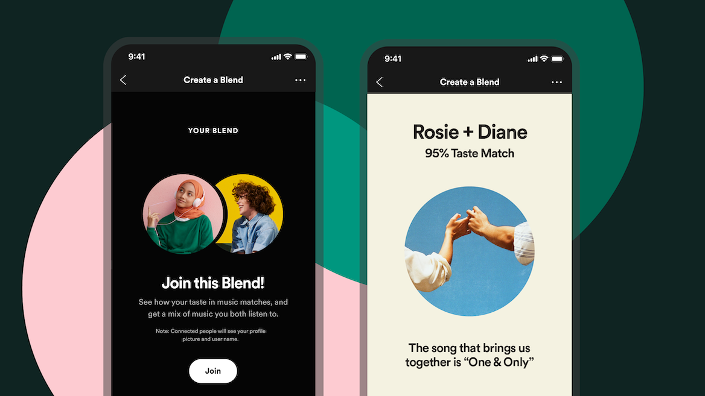
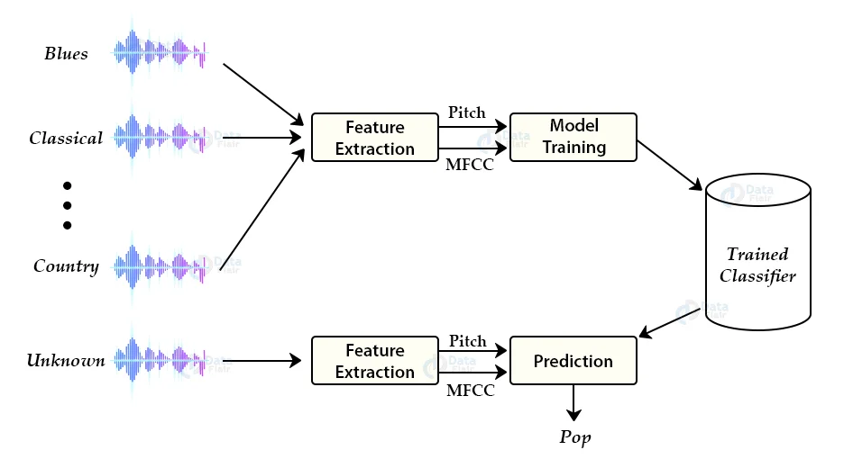

# CS 4641 Semester Project: Playlist Creation and Similarity
## Proposal: Semester Project for CS4641 

### Introduction/Background
Music is a constantly growing and changing field with new artists and songs popping up everyday. As more and more people have begun using different applications such as Apple Music, Spotify, etc., the process of sharing that music with their friends has grown more complex. With the sheer amount of music now available in the world, automatically curated playlists are becoming increasingly more important to both user enjoyment and artist exposure. Being able to generate playlists based on the tastes of two distinct users opens up multiple venues and could have great potential for the future of music streaming and sharing.

 
### Problem Statement
The problem that we are trying to solve is the “blending” of two playlists from separate users in order to create a combined playlist that both people would enjoy using. Our goal is to obtain Spotify song attributes through the Spotify API and make use of the GTZAN dataset in order to implement a supervised learning model that would be able to classify music into 10 distinct genres. From there we can then build a model that will accept audio tracks of songs from two separate playlists and combine them together. We will also give a percentage score that will be based on how much the two playlists matched in music taste which will likely be based on genre and many other Spotify song attributes.

 
### Methods
In order to build this model we will be using multiple forms of supervised learning such as Regression, Support Vector Machine, and K-Nearest Neighbors. These will help us to build our models based on the datasets that we are currently planning on using. The datasets that we currently have are the GTZAN Dataset, which is a dataset that contains 1,000 audio files over a range of 10 different genres that have already been classified, and a dataset we plan to create using the Spotify web API which will contain specific song attributes such as danceability, energy, key, loudness, and more. We then plan to use the Random Forest algorithm as our main form of classification, but are also looking into how to use Convolutional Neural Networks (CNN) as a form of classification as well.

 
### Potential Results and Discussion
Our desired outcome from this project would be to automatically generate a new playlist that would be optimized to elicit the highest level of enjoyment out of the user(s) from which it was made. The playlist would have the input of two or more playlists, and output a new playlist that was curated as a blend of the input playlists (This playlist may include new songs that were not in the input playlists that still match the “style blend” determined by the algorithm). Additionally, the algorithm would also output a percent score based on how similar the original playlists were in composition based on attributes like genre, energy, key, etc. 

### Tentative Timeline and Team Contribution
Proposal (October 7th)
* Sep 30th: 
  * Agreed on final project idea. [Team]
  * Assigned proposal tasks to each team member. [Team]
* Oct 5th: Completion of the proposal and reviews. [Team]
* Oct 6th: Completion of GitHub Page and the presentation recording. [Roque & Giorgio]

Midterm Report (November 11th)
* Oct 10th - 16th: Research about music genre classification and GTZAN genre collection dataset. Construct the workflow for the whole project. [Rithvik & Ahmad]
* Oct 17th - 23rd: Data preparation and exploratory data analysis. [Xinjin & Rithvik]
* Oct 24th - 30th: Feature selection and dimension reduction. Implement classic supervised algorithms with regression. [Roque & Giorgio]
* Oct 31st - Nov 6th: Implementation of SVM and KNN. [Xinjin & Ahmad]
* Nov 7th - Nov 11st: Validate the three algorithms, and finish the midterm report. [Team]

Final Project Report (December 6th)
* Nov 14th - 27th: Further deep learning algorithms implementation (CNN and more) [Roque & Giorgio].
* Nov 28th - Dec 5th: Review the final projects and report. Make a final presentation video. Finalize GitHub page. [Team]

### References
Tzanetakis, G., & Cook, P. (2002). Musical genre classification of Audio Signals. _IEEE Transactions on Speech and Audio Processing_, 10(5), 293–302. https://doi.org/10.1109/tsa.2002.800560 

Sciandra, M., & Spera, I. C. (2020). A model-based approach to Spotify data analysis: a Beta GLMM. In _Journal of Applied Statistics_ (Vol. 49, Issue 1, pp. 214–229). Informa UK Limited. https://doi.org/10.1080/02664763.2020.1803810

Sturm, B. L. (2012b). An analysis of the GTZAN music genre dataset. Proceedings of the Second International ACM Workshop on Music Information Retrieval With User-Centered and Multimodal Strategies - MIRUM ’12. https://doi.org/10.1145/2390848.2390851

### Proposal Video

